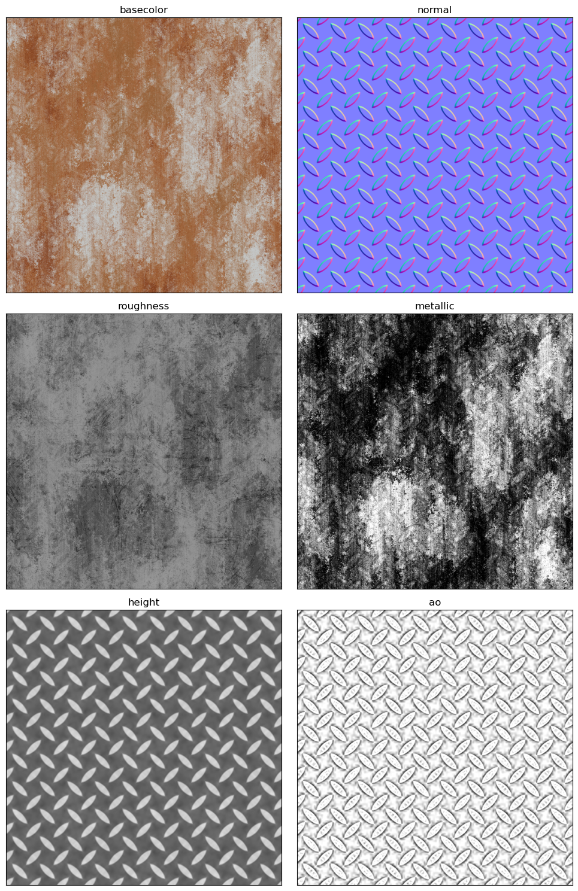
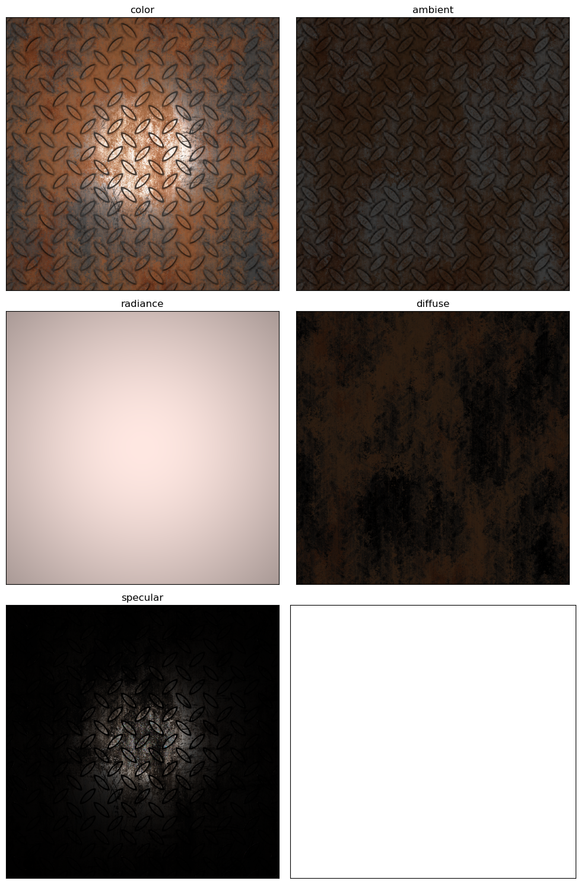

# mat-renderer
A simple physics-based differentiable material renderer based on Cook-Torrance model.

### Example material svBRDF maps:



### Rendered results:



### Environment setup

- [Anaconda](https://www.anaconda.com/), for environment management.

```
    conda env create -f environment.yaml
    conda activate mat-renderer
```

### Demo

- [demo.ipynb](demo.ipynb), for usage and examples.